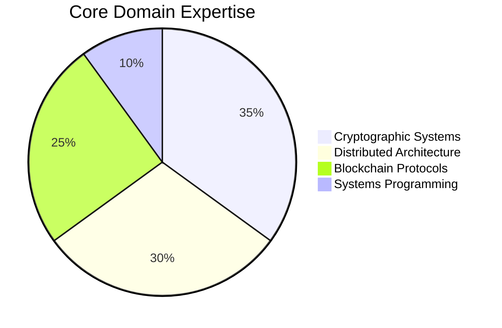

# Daniil Krizhanovskyi | Cryptography & Distributed Systems Architect

<div align="center">


[](https://github.com/arec1b0)
[](https://github.com/arec1b0?tab=repositories)

</div>


## About Me

> **"Building quantum-resilient decentralized infrastructure for the post-trust era"**

I'm a Distributed Systems Architect specializing in post-quantum cryptography, zero-knowledge proofs, and high-performance blockchain systems. Currently serving as CTO at [@PeoChain](https://github.com/PeoPay), where we're reimagining financial sovereignty through cryptographically secure distributed networks.

### Core Technical Focus

```rust
pub struct Expertise {
    cryptography: Vec<&'static str>,
    systems_engineering: Vec<&'static str>,
    blockchain_architecture: Vec<&'static str>,
}

impl Expertise {
    pub fn current() -> Self {
        Self {
            cryptography: vec![
                "Post-Quantum (Kyber, Dilithium, SPHINCS+)", 
                "Zero-Knowledge Systems", 
                "Threshold Cryptography"
            ],
            systems_engineering: vec![
                "Rust/C++ Performance Optimization", 
                "Distributed Consensus", 
                "Byzantine Fault Tolerance"
            ],
            blockchain_architecture: vec![
                "ZK-Rollups & Validity Proofs", 
                "Layer-2 Scaling Solutions", 
                "Cross-Chain Communication Protocols"
            ],
        }
    }
    
    pub fn impact(&self) -> &'static str {
        "Building systems that maintain security guarantees in adversarial environments"
    }
}
```

<div align="center">

[](https://www.rust-lang.org/)
[](https://isocpp.org/)
[](https://soliditylang.org/)
[](https://www.python.org/)

</div>

## Projects & Contributions

- **[PeoChain](https://peochain.xyz)**: Developing a quantum-resistant L2 protocol with privacy-preserving transaction capabilities
- **[zkEVM Implementation](https://github.com/arec1b0/zk-research)**: Research and implementation of zero-knowledge virtual machines
- **[Rust Cryptography](https://github.com/arec1b0/rust-crypto-utils)**: Library of optimized post-quantum cryptographic primitives

## Latest Research Focus

- Recursive proof composition for scalable zero-knowledge systems
- Constant-size non-interactive threshold signatures for decentralized consensus
- Memory-efficient implementations of lattice-based cryptographic schemes

## GitHub Analytics

<div align="center">
  
  
</div>

## Technical Proficiency



## Connect

<div align="center">

[](https://www.linkedin.com/in/dkrizhanovskyi-peo)
[](https://medium.com/@dk.arecibo)
[](mailto:d.krizhanovskyi@peochain.xyz)
[](https://x.com/arec1b0)

</div>

---

*"The challenge is not just building secure systems, but ensuring they remain secure against quantum adversaries."*