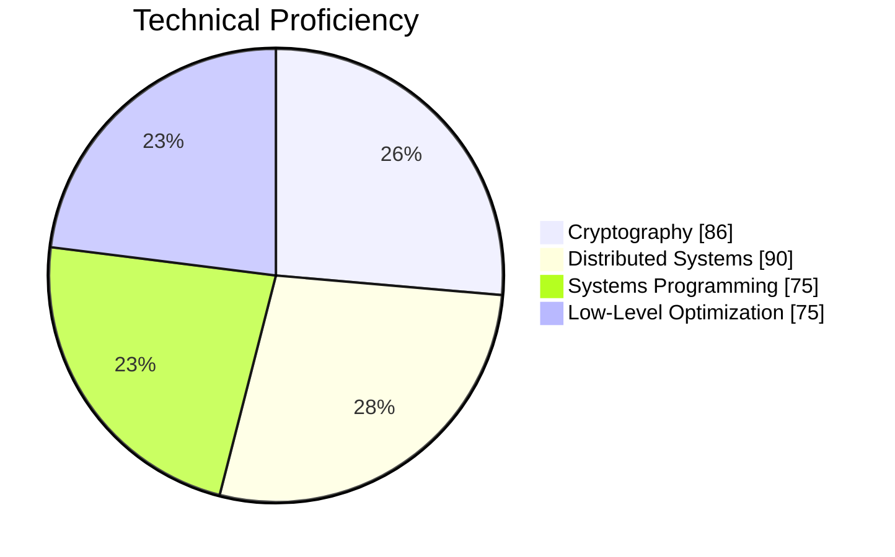

# Daniil Krizhanovskyi | Cryptography & Distributed Systems

<div align="center">


[](https://github.com/arec1b0)
[](https://github.com/arec1b0?tab=repositories)

</div>


## $ whoami?
> **"Architecting secure, scalable, quantum-resilient decentralized systems."**

Decentralized Systems Architect with deep expertise in quantum-resistant cryptography, secure distributed systems, and blockchain scalability. Currently CTO at [@**PeoChain**](https://github.com/PeoPay), driving innovation in financial decentralization.

### 🛠️ Core Technologies

- **Cryptography**: Post-Quantum Cryptography (Kyber, Falcon), zk-SNARKs, Elliptic-Curve Cryptography (ECC)
- **Languages**: Rust, C++, Solidity, Python
- **Blockchain**: Layer-2 Scaling (Rollups, ZK-EVM), Smart Contract Security, Consensus Algorithms (PoS, BFT)

[Explore PeoChain](https://peochain.xyz) | [Explore PeoPay](https://peopay.io)

```
impl Expertise {
    pub fn new() -> Self {
        Self {
            cryptography: vec!["PQC", "ECC", "zk-SNARKs"],
            languages: vec!["Rust", "C++", "Solidity"],
            blockchain: vec!["Consensus", "Smart Contracts", "L2 Scaling"],
        }
    }
}
```

<div align="center">

[](https://www.rust-lang.org/)
[](https://isocpp.org/)
[](https://soliditylang.org/)

</div>

## 📊 GitHub Analytics

<div align="center">
  
  
</div>

## 🎯 Expertise Matrix



## 📫 Connect

<div align="center">

[](https://www.linkedin.com/in/dkrizhanovskyi-peo)
[](https://medium.com/@dk.arecibo)
[](mailto:d.krizhanovskyi@peochain.xyz)
[](https://x.com/arec1b0)

</div>
